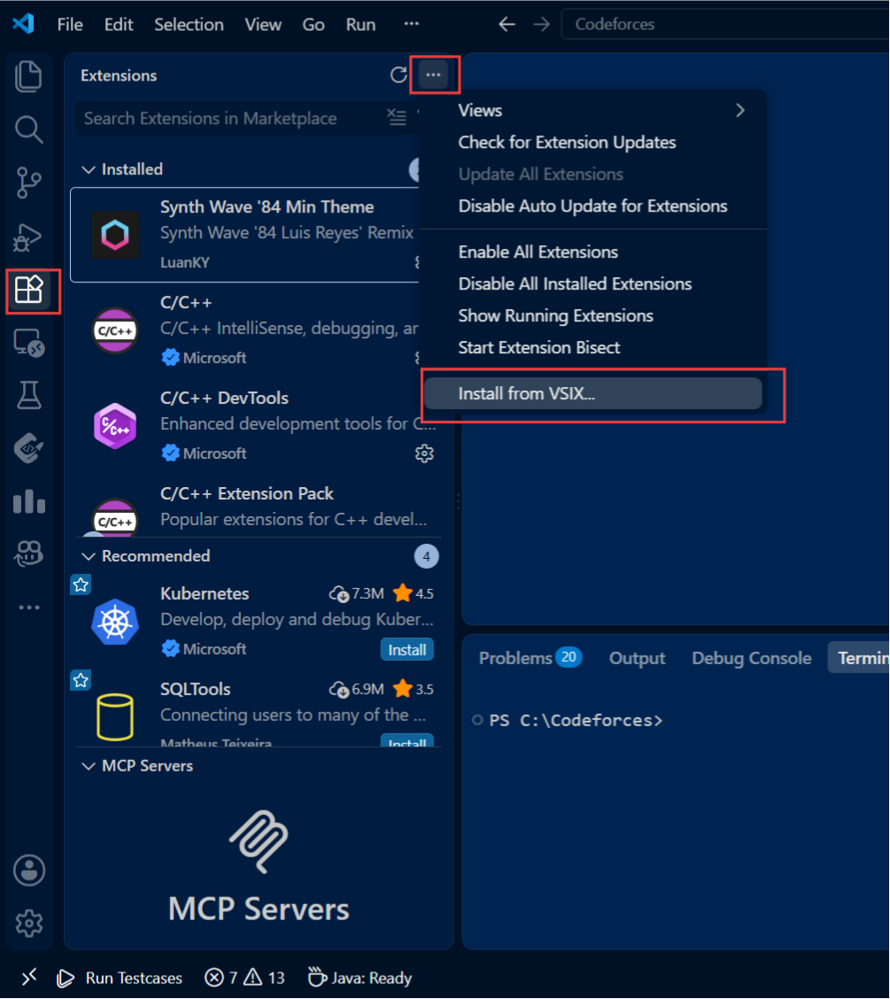
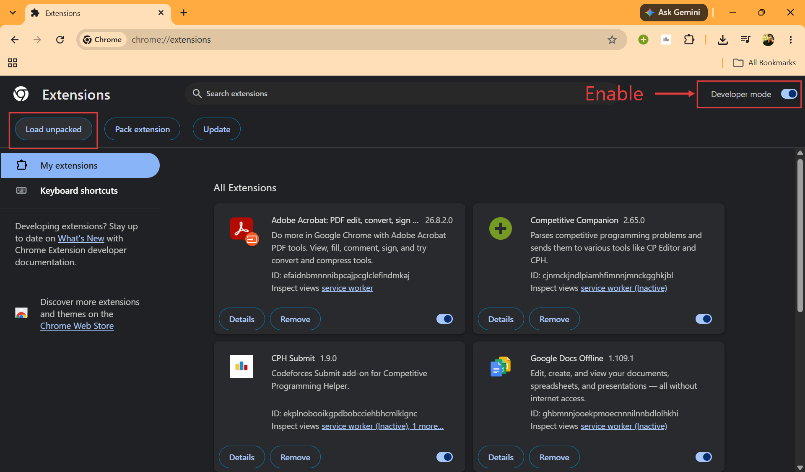
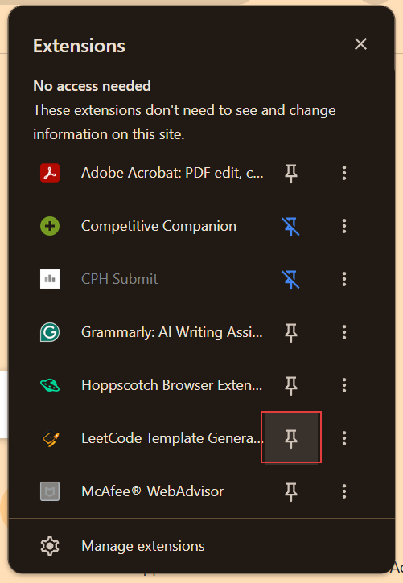
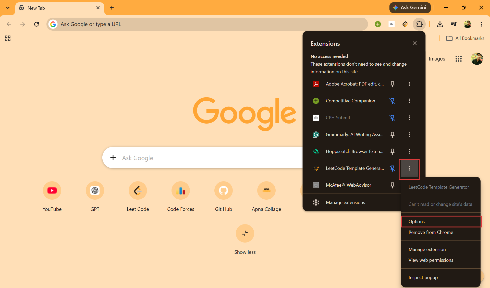

# LeetCode Helper 🚀

A local development tool that connects **LeetCode, Google Chrome, and Visual Studio Code** into one workflow.

LeetCode Helper lets you:

* Generate a templated solution file directly from a LeetCode problem.
* Store problem information and generated-template metadata in `.lch` files.
* Edit the generated solution inside VS Code.
* Push the code back into the correct LeetCode problem tab.
* Automatically open the problem in a new LeetCode tab when it is not already open.
* Paste code directly into LeetCode's Monaco editor.
* Optionally **Run** or **Submit** the code after pushing.
* Detect the LeetCode action transition before treating Run/Submit as successful.
* Wait for a fresh submission verdict such as `Accepted`, `Wrong Answer`, `Time Limit Exceeded`, or `Runtime Error`.
* Reset a solution file to its original generated template.

The project consists of a **Chrome Extension** and a **VS Code Extension** communicating through a local HTTP bridge running on `127.0.0.1:8765` by default.

---

# ✨ How It Works

The complete workflow has two directions.

```text
                    LEETCODE HELPER
                         │
          ┌──────────────┴──────────────┐
          │                             │
          ▼                             ▼
   LeetCode → VS Code            VS Code → LeetCode
          │                             │
          ▼                             ▼
   Read problem URL             Push edited solution
          │                             │
          ▼                             ▼
   Local HTTP bridge             Local HTTP bridge
          │                             │
          ▼                             ▼
   Generate template            Chrome background worker
          │                             │
          ▼                             ▼
      .lch metadata              Find/open LeetCode tab
          │                             │
          ▼                             ▼
      Solution file                  Monaco
                                        │
                              ┌─────────┴─────────┐
                              │                   │
                            Run                 Submit
                              │                   │
                              ▼                   ▼
                         Run transition       Judging
                                                  │
                                                  ▼
                                             Final verdict
```

The bridge uses HTTP long-polling instead of a WebSocket. This allows the Chrome extension to communicate with the local VS Code server without relying on an insecure `ws://` connection from a secure LeetCode page.

Reverse pushes use acknowledged delivery: VS Code retains a job until Chrome confirms
receipt, redelivers an unacknowledged job, and Chrome retries progress/final reports if
the loopback connection briefly fails. Multiple pending pushes are queued in order.

Before reporting a successful paste, the Chrome worker selects the visible LeetCode
solution model (rather than the first Monaco model), applies the edit, and reads the
model back to verify the exact content. Existing and newly opened tabs both wait for
the editor to finish mounting, and transient remounts are retried.

Before writing, Chrome compares the language recorded in the solution's `.lch`
metadata with the visible LeetCode Monaco model. If they differ, the push stops and
leaves the browser editor unchanged.

---

# 📦 Project Structure

```text
LeetCode_Helper/
│
├── chrome-extension/
│   ├── manifest.json
│   ├── options.html
│   ├── resources/
│   ├── styles/
│   └── src/
│
├── vscode-extension/
│   ├── package.json
│   ├── config.json
│   ├── resources/
│   └── src/
│
└── README.md
```

The Chrome extension contains the MV3 background worker, one-click toolbar action, settings page, browser bridge client, LeetCode URL handling, and injected page functions. The VS Code extension contains the local server, solution generator, metadata store, push queue, sidebar view, and LeetCode integration logic.

---

# 🛠️ Installation

## Requirements

Before installing LeetCode Helper, make sure you have:

* **Google Chrome**
* **Visual Studio Code**
* A **LeetCode account**
* Permission to install a Chrome extension in Developer Mode

---

## 1. Install the VS Code Extension

The VS Code extension can be installed from a `.vsix` package.

Download the latest `.vsix` package from the GitHub Release:

**[⬇️ Download latest VS Code Extension](https://github.com/Satyam-Agr/LeetCode_Helper/releases/latest/download/leetcode-helper-vscode.vsix)**

### Method A: Install from VSIX

1. Open VS Code.
2. Open the **Extensions** panel.
3. Click the `...` menu at the top of the Extensions panel.
4. Select **Install from VSIX...**
5. Select the downloaded:

```text
leetcode-helper-vscode.vsix
```



### Method B: Command line

You can also install the package using:

```bash
code --install-extension leetcode-helper-vscode.vsix
```

The VS Code extension starts the local browser bridge used by the Chrome extension. The default bridge address is:

```text
http://127.0.0.1:8765
```

The port can be changed through:

```text
vscode-extension/config.json
```

The VS Code extension supports an installable `.vsix` package and its development workflow does not require bundling.

---

# 🌐 2. Install the Chrome Extension

Because the extension is distributed outside the Chrome Web Store, it must currently be installed as an **unpacked extension**.

Download the latest `.zip` package from the GitHub Release:

**[⬇️ Download latest Chrome Extension](https://github.com/Satyam-Agr/LeetCode_Helper/releases/latest/download/leetcode-helper-chrome.zip)**

Use this named release asset, not GitHub's automatically generated **Source code**
archive. The source archive contains the whole repository and cannot be loaded directly
as the Chrome extension.

### Step 1: Extract the .zip

Extract the downloaded zip folder.
Make sure that the root folder has `manifest.json`.

### Step 2: Open Chrome Extensions

Open:

```text
chrome://extensions
```

### Step 3: Enable Developer Mode

Turn on the **Developer mode** switch in the top-right corner.

### Step 4: Load the Extension

Click:

```text
Load unpacked
```

### Step 5: Select the Extension Folder

Select the extracted folder that directly contains:

```text
manifest.json
```

Make sure the selected folder directly contains:

```text
manifest.json
```

Do **not** select the repository root if `manifest.json` is inside `chrome-extension/`.



### Step 6: Confirm Installation

After loading the extension, it should appear under **My extensions**.

The extension uses Chrome Manifest V3 and requests the permissions required to access LeetCode tabs, inject the page-side functionality, communicate with the local bridge, and maintain its polling loop.

After installation, pin the extension in your browser as shown in the image:



### Step 7: Automatic local pairing

No pairing setup is required. Chrome and VS Code establish authentication automatically
on the first local request. The Chrome package has a stable extension ID; VS Code issues
its random 256-bit token only to that extension origin using the matching bridge
protocol. Chrome keeps the token in its private extension storage and retries the
original request immediately.

If the token is rotated or Chrome storage is cleared, the same automatic handshake runs
again. The VS Code diagnostics show only a short fingerprint, never the token itself.

---

# 🔧 3. Start the Browser Bridge

The VS Code extension provides the local HTTP server used by Chrome.

The default address is:

```text
http://127.0.0.1:8765
```
Only one VS Code window owns the port at a time. Other windows wait in the background
and automatically take over if the current owner closes. Make sure port `8765` is not
being used by an unrelated application.

The bridge exposes the following routes:

```text
POST /generate  { url, requestId }
GET  /health
POST /pair
GET  /settings
POST /settings
POST /choose-destination
GET  /pull
POST /push-result
```

These routes are used for generation, automatic pairing, settings, push queuing,
long-polling, and reporting Run/Submit results. `/pair` requires the exact Chrome
extension origin and current protocol version. All normal operational routes require
both that protocol version and the resulting random token.

You can start the bridge from the VS Code command palette:

```text
LeetCode Generator: Start Browser Bridge
```

You can also check its state with:

```text
LeetCode Generator: Browser Bridge Status
```

---

# 🚀 User Guide

## 1. Generate a Solution From LeetCode

Open a LeetCode problem in Chrome.

For example:

```text
https://leetcode.com/problems/two-sum/
```

Click the LeetCode Helper toolbar icon. Generation starts immediately without opening
a popup. The page shows a progress/result toast. Success disappears automatically after
five seconds; failures remain until you dismiss them so important errors are not lost.

The extension sends the current problem URL and a unique request ID to the local VS
Code bridge. If VS Code is still starting, connection failures are retried automatically.

The VS Code extension then:

1. Fetches the problem information.
2. Determines the problem slug and language configuration.
3. Generates the solution template.
4. Creates the solution file.
5. Writes the corresponding `.lch` metadata file.

The generated solution and its metadata are stored locally.

---

# 📄 2. `.lch` Metadata

Every generated solution has a matching metadata file.

Example:

```text
.lch/
└── 0001-two-sum.lch
```

The metadata stores information such as:

```text
Problem URL
Template
LeetCode starter code
Generated content
Solution path
```

This allows the extension to understand which LeetCode problem belongs to the active solution and enables features such as pushing and resetting the template.

The `.lch` folder is stored inside the configured metadata folder. If that setting is empty or points to a missing folder, the workspace root is used.

---

# ✍️ 3. Solve the Problem in VS Code

Open the generated solution file and write your solution normally.

The generated file contains the LeetCode starter/template structure and your implementation can be edited directly in VS Code.

---

# 📤 4. Push Code to LeetCode

Open the:

```text
LeetCode Generator
```

Activity Bar view in VS Code.

Open:

```text
Push to LeetCode
```

The Push view provides:

* The active linked solution file
* **Copy code section only**
* **After paste** action
* **Push to LeetCode**
* **Reset to template**

The problem URL is intentionally not displayed in the Push view.

---

# 🧩 5. Copy Code Section Only

The **Copy code section only** option allows the extension to send only the relevant solution code instead of the entire file.

When enabled, the extension:

1. Reads the LeetCode starter snippet from `.lch` metadata.
2. Finds the first real code line, such as:

```java
class Solution {
```

3. Uses that line as the beginning of the code section.
4. Copies the solution through the final `}`.
5. Preserves the starter snippet's leading comments where appropriate.

If the anchor cannot be found, the extension falls back to sending the entire file.

---

# ▶️ 6. After Paste: Do Nothing / Run / Submit

The **After paste** setting controls what Chrome should do after inserting the code into LeetCode.

### Do Nothing

Only paste the code.

```text
VS Code
  ↓
Chrome
  ↓
LeetCode Monaco
```

### Run

Paste the code and click:

```text
Run
```

The browser observer waits for a recognizable LeetCode Run transition before the action is reported as successful.

### Submit

Paste the code and click:

```text
Submit
```

The extension first confirms the submission-related UI transition.

After that, it reports:

```text
Judging...
```

and waits for a fresh final verdict.

Possible results include:

```text
Accepted
Wrong Answer
Time Limit Exceeded
Memory Limit Exceeded
Output Limit Exceeded
Runtime Error
Compile Error
```

The bridge reports these results back to VS Code. The VS Code sidebar displays the final status, with non-Accepted results treated as warnings.

---

# 🔄 7. What Happens When the Problem Is Not Open?

When a push is requested, Chrome checks the currently open LeetCode tabs.

### If the problem is already open

```text
Find matching tab
       ↓
Focus tab
       ↓
Paste code
       ↓
Run / Submit if requested
```

### If the problem is not open

```text
Open new LeetCode tab
       ↓
Wait for Monaco
       ↓
Paste code
       ↓
Run / Submit if requested
```

The browser bridge is informed when a fresh tab is being opened so the job gets additional time for the LeetCode page to load.

---

# 🔍 8. Submit Status and Verdict Handling

A Submit operation is handled in multiple stages.

```text
Submit requested
      ↓
Observer installed
      ↓
Submit button clicked
      ↓
LeetCode UI transition detected
      ↓
Judging
      ↓
Wait for new verdict
      ↓
Accepted / Wrong Answer / ...
```

The browser does not simply assume that `button.click()` means the submission has completed.

The VS Code bridge first receives a judging state and then waits for the final result.

If no new final verdict is received within the allowed time, the push is reported as an error rather than reusing an old verdict.

---

# 🔁 9. Reset to Template

The **Reset to template** button restores the original generated solution content.

It uses the `.lch` metadata associated with the active file and asks for confirmation before overwriting the current file.

```text
Current solution
      ↓
Reset to template
      ↓
Confirmation
      ↓
Original generated content
```

This is useful when you want to discard your current implementation and start the problem again.

---

# ⚙️ 10. Generator Settings

The Chrome options page allows you to configure generator settings such as:

* Programming language
* Solution folder
* Metadata folder
* Filename pattern
* ID padding
* Template
* Headers

The settings are validated before being stored.

It can be accessed from the extension's Options page:



---

# 🗂️ Destination Modes

The VS Code extension supports two solution destination modes:

### Workspace

Solutions are written into the first detected workspace folder.

### Selected

A specific folder can be selected through the VS Code interface.

If the selected folder no longer exists, the extension falls back to the workspace mode. Difficulty grouping can also create:

```text
Easy/
Medium/
Hard/
```

folders under the configured root.

---

# 🌐 Why HTTP Long-Polling?

The project deliberately uses HTTP long-polling rather than a WebSocket connection.

The architecture is:

```text
LeetCode
   │
   │ Chrome Extension
   ▼
Chrome MV3 Background Worker
   │
   │ HTTP
   ▼
127.0.0.1:8765
   │
   ▼
VS Code Extension
```

The Chrome background worker holds `GET /pull` open for a limited period and immediately receives queued push jobs when available. Errors are retried and the worker is periodically re-kicked with Chrome alarms.

---

# 🧪 Development Setup

## VS Code Extension

```bash
cd vscode-extension
npm install
npm test
npm run check
```

Open the extension folder in VS Code and press:

```text
F5
```

This launches the Extension Development Host.

Then open a coding workspace inside the Extension Development Host and use the **LeetCode Generator** Activity Bar view.

---

## Chrome Extension

The Chrome extension does not require a build step. Install its test dependency once,
then run its unit and real-browser suites:

```bash
cd chrome-extension
npm install
npm test
npx playwright install chromium
npm run test:e2e
```

`npm run test:all` runs both suites. The browser suite loads the actual unpacked
extension and verifies C++, Java, Python, and JavaScript paste flows, mismatch
protection, new-tab editor mounting, duplicate-tab selection, Run, and Submit against
deterministic fixtures.

For development:

```text
1. Open chrome://extensions
2. Enable Developer mode
3. Click Load unpacked
4. Select chrome-extension/
5. Open a LeetCode problem
```

The Chrome extension uses Manifest V3 and native JavaScript modules.

---

# 📦 Packaging the VS Code Extension

To create a distributable VS Code package using the pinned project dependency:

```bash
cd vscode-extension
npm ci
npm run package
```

This produces a `.vsix` file.

Install it from:

```text
VS Code
→ Extensions
→ ...
→ Install from VSIX...
```

The VS Code extension's packaging workflow is documented in the project itself.

---

# 🚀 Automated Releases

Pull requests and updates to `main` run the Chrome and VS Code checks on Windows and
Linux, plus the installed-extension browser tests on Linux. Stable `vMAJOR.MINOR.PATCH`
tags build and publish the Chrome ZIP, VSIX, checksums, and build-provenance records.

Both component package versions must match the tag. The bridge protocol number is a
separate compatibility value and changes only when the Chrome/VS Code wire contract is
incompatible.

See [RELEASING.md](docs/RELEASING.md) for version preparation, tagging, retry behavior, and
the one-time GitHub branch/tag protection settings.

Releases can also include a reviewed, version-specific summary and detailed bug-fix or
upgrade report without losing GitHub's automatic changelog. See the
[custom release-notes guide](docs/RELEASE_NOTES.md).

---

# 🧭 Quick Start

For a new user, the shortest path is:

```text
1. Install the VS Code .vsix
2. Load chrome-extension/ into Chrome
3. Open a LeetCode problem (pairing happens automatically)
4. Click the Chrome extension toolbar icon once
5. Start solving in VS Code
6. Open Push to LeetCode
7. Choose:
      Do Nothing
      Run
      Submit
8. Push the solution
```

---

# 🐛 Troubleshooting

## Chrome extension does not respond

Check:

```text
chrome://extensions
```

and make sure the extension is enabled.

Then verify that the VS Code browser bridge is running.

The toolbar action retries short startup interruptions automatically. An in-page error
remains visible when the bridge cannot be reached after all retries.

---

## VS Code cannot communicate with Chrome

Check that the browser bridge is running on:

```text
http://127.0.0.1:8765
```

and that the configured port matches between the VS Code and Chrome sides.

Then right-click the Chrome extension, open **Options**, and click **Test connection**.
The test automatically repairs missing or expired authentication. If it reports an
extension identity mismatch, reload Chrome from the current `chrome-extension/` folder.

For a complete local report, run **LeetCode Helper: Run Diagnostics** in VS Code. The
Output panel shows bridge ownership, protocol version, pairing-token fingerprint,
whether Chrome has polled recently, queue state, current workspace and destinations,
and the active file's metadata/language. It does not transmit telemetry.

---

## Chrome/VS Code version mismatch

The compatibility number is `BRIDGE_PROTOCOL_VERSION`, currently `3`, in both
`chrome-extension/src/protocol.js` and `vscode-extension/src/protocol.js`. Those two
values must match. Change this number only for an incompatible communication/API change,
not for every bug fix. The normal extension versions in `manifest.json` and
`package.json` are release numbers; keeping them equal is useful but is not what decides
whether the bridge can communicate. An automated test fails if the protocol numbers
drift apart.

If a mismatch is reported, update or reload both extensions from the same project
release. Incompatible requests are rejected before any file or browser-editor change.

---

## Local authentication boundary

Automatic pairing protects the bridge from ordinary webpages and unrelated Chrome
extensions by checking the stable LeetCode Helper extension origin before issuing the
random token. It is not intended to defend against malicious software already running
as your Windows user, because a native program can construct local HTTP requests and
spoof headers. Strong protection against that threat would require a manually verified
secret or a separately installed Chrome Native Messaging host.

---

## Language mismatch when pushing

Select the same language in the LeetCode editor that was used to generate the local
solution, then push again. The mismatch guard intentionally leaves the editor unchanged.

---

## Monaco editor was not found

Refresh the LeetCode page and try again.

A newly opened LeetCode problem can take time to initialize the Monaco editor before code can be injected.

---

## Submit does not finish

The extension waits for a fresh final verdict. If LeetCode does not produce one within the configured timeout, the operation is reported as an error rather than assuming an earlier verdict belongs to the new submission.

---

## No `.lch` metadata found

Make sure the active file was generated through LeetCode Helper and that its associated `.lch` metadata still exists.

---

